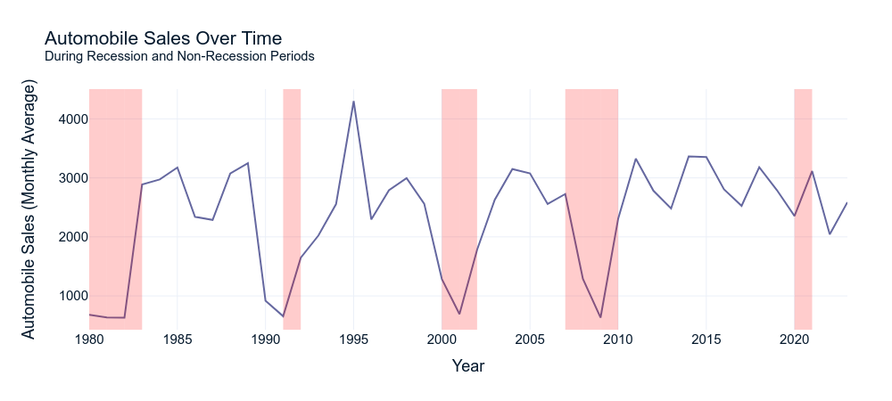
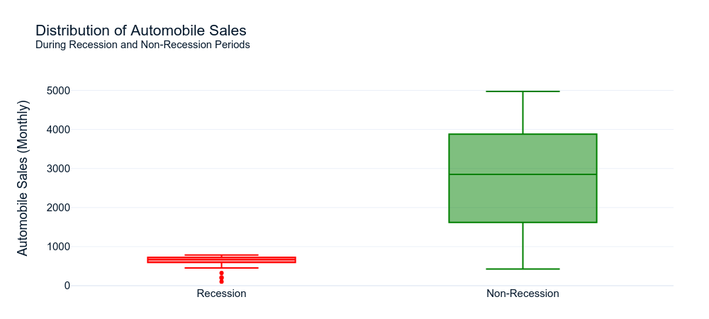
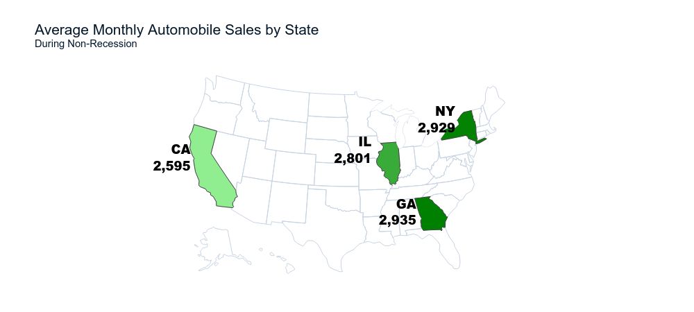
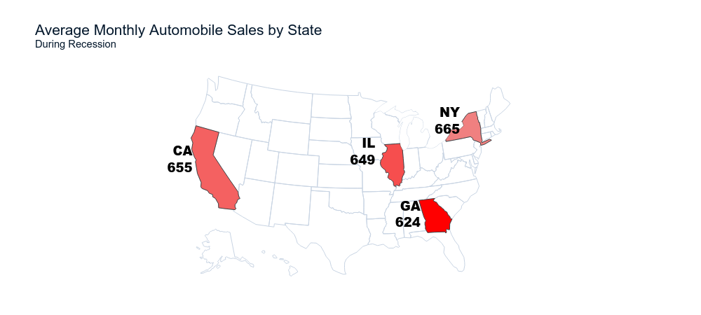
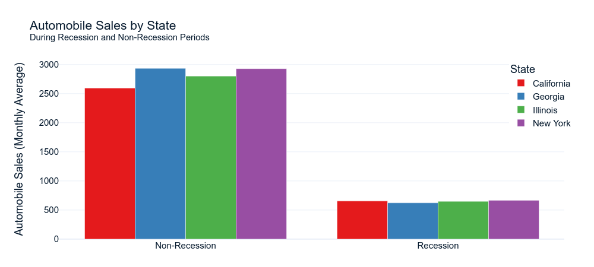

# Impact of Recession on Automobile Sales

In this analysis, we will try to understand the historical trends in automobile sales during recession periods.
- Recession period 1: year 1980
- Recession period 2: year 1981 to 1982
- Recession period 3: year 1991
- Recession period 4: year 2000 to 2001
- Recession period 5: year-end 2007 to mid-2009
- Recession period 6: year 2020 - Feb to April (Covid-19 Impact)

### Data Description

The dataset we will be using contains *historical_automobile_sales* data representing automobile sales and related variables during the recession and non-recession periods.

The dataset includes the following variables:
- **Date**: The date of the observation.
- **Recession**: A binary variable indicating a recession period; 1 means it was a recession, and 0 means it was normal.
- **Automobile_Sales**: The number of vehicles sold during the period (monthly).
- **GDP**: The per capita GDP value in USD.
- **Unemployment_Rate**: The monthly unemployment rate.
- **Consumer_Confidence**: A synthetic index representing consumer confidence, which can impact consumer spending and automobile purchases.
- **Seasonality_Weight**: The weight representing the seasonality effect on automobile sales during the period.
- **Price**: The average vehicle price during the period.
- **Advertising_Expenditure**: The advertising expenditure of the company.
- **Vehicle_Type**: The type of vehicles sold; Superminicar, Small family car, Medium family car, Executive car, Sports.
- **Competition**: The measure of competition in the market, such as the number of competitors or market share of major manufacturers.
- **Month**: Month of the observation extracted from Date.
- **Year**: Year of the observation extracted from Date.

By examining various factors mentioned above from the dataset, we aim to gain insights into how recessions impacted automobile sales for this company.

### Questions to Explore
1. How do automobile sales trend over time during recession and non-recession periods?
2. What is the distribution of automobile sales during recession and non-recession periods?
3. Is there a significant difference in automobile sales between recession and non-recession periods?
4. How do automobile sales vary across different regions during recession periods?
5. How does the recession impact sales of different vehicle types?

## How do automobile sales trend over time during recession and non-recession periods?

The time series graph reveals a cyclical pattern in automobile sales, with distinct periods of higher sales during non-recession times and sharp declines during recessions (highlighted in red). The graph also shows that while recessions cause significant drops, the industry tends to recover quickly once the recession ends, returning to pre-recession levels in a relatively short time.

## What is the distribution of automobile sales during recession and non-recession periods?

The box plot visually emphasizes the stark contrast in automobile sales distribution between recession and non-recession periods. The non-recession period shows a much higher median and wider range of sales, while the recession period is characterized by a compressed, lower range of sales. The average sales drop by `77%` during recessions, highlighting the severe economic impact on the automotive industry.

## Is there a significant difference in automobile sales between recession and non-recession periods?

The statistical analysis provides strong evidence of a significant difference in automobile sales between recession and non-recession periods. The extremely low p-value (`1.7987e-41`) and high t-statistic (`-14.7531`) underscore the profound and consistent negative impact of recessions on the automotive market.

## How do automobile sales vary across different regions during recession periods?

Automobile sales across different regions show similar patterns of decline during recessions, with Georgia experiencing the steepest drop (`78.7%`). Interestingly, California, despite having the lowest non-recession sales, shows the smallest percentage decrease (`74.8%`) during recessions, indicating potentially more resilient market conditions in this state.

## How does the recession impact sales of different vehicle types?

The recession dramatically impacts automobile sales across all vehicle types, with sports cars experiencing the most severe decline (`94.2%` decrease). While all categories see significant drops, economy models like supermini cars and small family cars are relatively less affected, suggesting consumers prioritize affordability during economic downturns.

